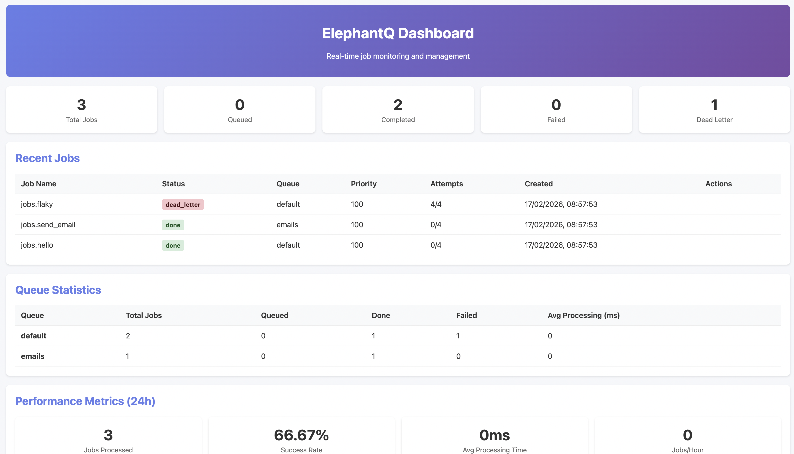

# ElephantQ

**PostgreSQL-first background jobs for Python.**

ElephantQ is a modern, async-first job queue that uses PostgreSQL as the only backend. No Redis, no broker services, no operational sprawl. You get reliable queues, retries, scheduling, and a dashboard in a single package.

## Why ElephantQ

- One backend: PostgreSQL only. No Redis or broker to deploy or maintain.
- Async-native API: use `async def` jobs and `await` enqueue.
- Explicit worker model: predictable production behavior, easy to scale.
- Built-in features in the same package (opt-in flags).
- Strong DX: clean CLI, clear job discovery, minimal boilerplate.
- Scales well: uses Postgres `LISTEN/NOTIFY` for fast wakeups and row locking for safe concurrency.

## Quick Start

**Prerequisites:** PostgreSQL

```bash
# 1. Install
pip install "git+https://github.com/fastjob-dev/fastjob#subdirectory=elephantq"

# 2. Set your database URL
export ELEPHANTQ_DATABASE_URL="postgresql://localhost/your_db"

# 3. Initialize database (creates tables)
elephantq setup
```

*Note: ElephantQ is not yet on PyPI.*

## Architecture at a Glance

- Your app enqueues jobs directly into PostgreSQL; no broker, no separate result store.
- Workers poll with `LISTEN/NOTIFY` plus `FOR UPDATE SKIP LOCKED`; horizontal workers never fight over rows.
- Feature flags gate dashboard, metrics, dead-letter, scheduling, signing, timeouts, dependencies, and more.

## Design Choices

- **PostgreSQL-only stack** keeps reliability predictable and operations simple while leveraging existing transactions.
- **Explicit scheduler command (`elephantq scheduler`)** runs only when you need recurring/cron jobs. For development, `elephantq dev` bundles worker + scheduler + dashboard.
- **Feature flag gating** keeps `elephantq.enqueue`, `elephantq.start`, and the global API lean even though dashboard, metrics, signing, and webhooks live in the same repository.
- **Built-in observability**: CLI reports job counts, the dashboard paints job/queue metrics, and optional metrics/Prometheus data live under `elephantq.features.metrics`.

### Minimal App (FastAPI)

```python
import elephantq
from fastapi import FastAPI

app = FastAPI()

elephantq.configure(database_url="postgresql://localhost/myapp")

@elephantq.job()
async def process_upload(file_path: str):
    print(f"Processing {file_path}")

@app.post("/upload")
async def upload_file(file_path: str):
    job_id = await elephantq.enqueue(process_upload, file_path=file_path)
    return {"job_id": job_id}
```

### Run Workers

ElephantQ workers always run as a **separate process**.

```bash
# Terminal 1: Your app
uvicorn app:app

# Terminal 2: Workers (needs discovery)
export ELEPHANTQ_JOBS_MODULES="app"
elephantq start --concurrency 4
```

`ELEPHANTQ_JOBS_MODULES` drives the discovery snippet shown above. Run the scheduler daemon when you need recurring/crontab-style jobs—just like Celery keeps Beat and workers separate, ElephantQ keeps recurring work in a dedicated process so workers stay focused on execution. citeturn0search2

```bash
ELEPHANTQ_SCHEDULING_ENABLED=true elephantq scheduler
```

`elephantq dev` bundles worker, scheduler, and dashboard for local experimentation, and the dashboard itself lives behind `ELEPHANTQ_DASHBOARD_ENABLED=true elephantq dashboard`. Add `ELEPHANTQ_DASHBOARD_WRITE_ENABLED=true` if you need retry/delete/cancel buttons.

## Dashboard Preview



## ElephantQ vs Alternatives

| Aspect | Celery | Solid Queue | ElephantQ |
| --- | --- | --- | --- |
| Backend | Redis/RabbitMQ/SQS or SQLAlchemy; brokers + result stores are configured separately. citeturn0search2 | Rails Active Job backed by PostgreSQL/SQL; runs as part of a Rails app/worker. citeturn0search0 | ✅ PostgreSQL-only; LISTEN/NOTIFY driven worker. |
| Scheduling | `beat` + `celery` worker; scheduling handled by the broker with separate process. citeturn0search2 | Scheduler lives inside SolidQueue with Rails hooks. citeturn0search0 | Built-in `elephantq scheduler` covering cron/interval + recurring helpers. |
| Concurrency controls | Worker pools/acks configured per worker; no per-job key locking. | Fine-grained concurrency limits, priorities, pausing, and inline uniqueness. citeturn0search0 | Queue routing, unique jobs, and optional dependency/timeouts for flow control. |
| Observability | Flower and exporter dashboards; broker-level stats. citeturn0search3 | Rails logging/Active Job dashboards. citeturn0search1 | Built-in dashboard, metrics, CLI reporting, and Prometheus-friendly collectors. |
| Getting started | More configuration: choose broker + backend + worker command. | Rails app + SolidQueue plus Redis/DB depending on config. | ✅ `pip install` from GitHub, `elephantq start`, `scheduler`, `dashboard`, `dev`. |

## Examples (Practical)

### Reliable Retries (Backoff)

```python
import elephantq

@elephantq.job(retries=5, retry_delay=1, retry_backoff=True, retry_max_delay=30)
async def resilient_task(user_id: int):
    ...
```

### Queue Routing

```python
import elephantq

@elephantq.job(queue="emails")
async def send_email(to: str):
    ...

@elephantq.job(queue="media")
async def transcode_video(video_id: str):
    ...
```

```bash
# Process only specific queues
elephantq start --queues emails,media
```

### Delayed Jobs (One-Off Scheduling)

```python
import elephantq

@elephantq.job()
async def remind_user(user_id: int):
    ...

# Run in 10 minutes
await elephantq.schedule(remind_user, run_in=600, user_id=42)
```

### Recurring Jobs (Cron)

```python
import elephantq

after_midnight = "0 2 * * *"

@elephantq.job()
async def nightly_report():
    ...

await elephantq.features.recurring.cron(after_midnight).schedule(nightly_report)
```

Make sure `ELEPHANTQ_SCHEDULING_ENABLED=true` is set when using recurring jobs.

### Instance-Based API (Multi-tenant or Separate DBs)

```python
from elephantq import ElephantQ

billing = ElephantQ(database_url="postgresql://localhost/billing")

@billing.job()
async def invoice_customer(customer_id: int):
    ...

await billing.enqueue(invoice_customer, customer_id=123)
```

## Examples Directory

Runnable examples live in `examples/`:

- `examples/basic_app.py` – minimal FastAPI enqueue flow
- `examples/recurring_jobs.py` – recurring scheduler patterns
- `examples/queue_routing.py` – multi-queue routing and worker config
- `examples/file_processing.py` – background file processing pattern
- `examples/webhook_delivery.py` – webhook delivery smoke example

## Queue Design Tips

- Use separate queues for different workloads (e.g., `emails`, `media`, `billing`).
- Keep job payloads small; store large blobs elsewhere and pass IDs.
- Use retries with backoff for flaky external APIs.
- Start with 1–4 workers locally; scale by adding worker processes.

## Optional Features (Same Package)

Advanced features live under `elephantq.features` and are **opt-in** via flags. Core job APIs (`job`, `enqueue`, `schedule`, workers) remain in the main package. The dashboard and monitoring features also require their optional dependencies (see extras below).

```bash
pip install elephantq[dashboard]
pip install elephantq[monitoring]
pip install elephantq[all]
```

Enable feature flags:

```bash
export ELEPHANTQ_DASHBOARD_ENABLED=true           # enable dashboard UI
export ELEPHANTQ_DASHBOARD_WRITE_ENABLED=true     # allow retry/delete actions
export ELEPHANTQ_SCHEDULING_ENABLED=true          # recurring + delayed jobs
export ELEPHANTQ_DEAD_LETTER_QUEUE_ENABLED=true   # dead letter queue
export ELEPHANTQ_METRICS_ENABLED=true             # metrics endpoints
export ELEPHANTQ_LOGGING_ENABLED=true             # structured logging
export ELEPHANTQ_WEBHOOKS_ENABLED=true            # webhooks on job events
export ELEPHANTQ_DEPENDENCIES_ENABLED=true        # job dependencies
export ELEPHANTQ_TIMEOUTS_ENABLED=true            # job timeouts
export ELEPHANTQ_SIGNING_ENABLED=true             # optional helpers (signing, secrets utils)
```

Example usage:

```python
import elephantq

metrics = await elephantq.features.metrics.get_system_metrics()
stats = await elephantq.features.dead_letter.get_stats()
```

## Troubleshooting

### "Job not registered"

If the worker says a job is not registered, it means the worker did not import your module.

✅ Fix:

```bash
export ELEPHANTQ_JOBS_MODULES="your_app_module"
elephantq start
```

## CLI

```bash
elephantq setup
elephantq start --concurrency 4 --queues default,urgent
elephantq scheduler
elephantq dashboard --port 6161  # read-only by default
elephantq metrics --hours 24
elephantq dead-letter list
```

## Documentation

- `docs/getting-started.md`
- `docs/cli.md`
- `docs/scheduling.md`
- `docs/features.md`
- `docs/production.md`
