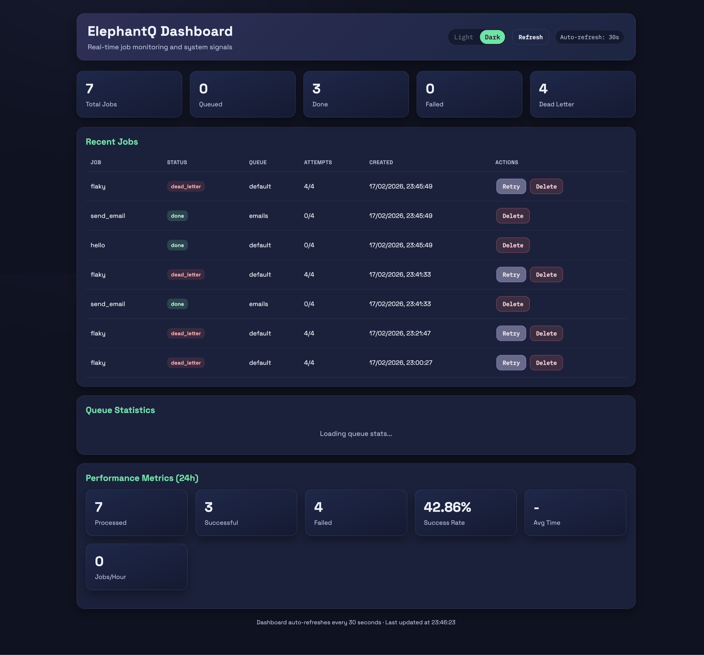

# ElephantQ

Async-native background job queue — zero setup to start, PostgreSQL for production.

## Quick start — no database server needed

```bash
pip install elephantq
```

```python
import elephantq

# SQLite backend — auto-detected from .db extension
elephantq.configure(database_url="jobs.db")

@elephantq.job(retries=3)
async def send_welcome(to: str):
    print(f"sending welcome to {to}")

await elephantq.enqueue(send_welcome, to="team@example.com")
await elephantq.run_worker(run_once=True)
```

No PostgreSQL, no Redis, no Docker. Just `pip install` and go.

## Move to production — switch to PostgreSQL

```bash
export ELEPHANTQ_DATABASE_URL="postgresql://postgres@localhost/elephantq"
elephantq setup   # create tables
elephantq start --concurrency 4 --queues default,emails
```

Your code stays the same. ElephantQ auto-detects PostgreSQL from the URL and unlocks concurrent workers, push notifications (`pg_notify`), and transactional enqueue.

## Transactional enqueue

Enqueue a job inside your application’s database transaction. If the transaction rolls back, the job never enters the queue.

```python
async with pool.acquire() as conn:
    async with conn.transaction():
        await conn.execute("INSERT INTO orders ...")
        await elephantq.enqueue(send_invoice, connection=conn, order_id=order_id)
        # If this transaction fails, the job is never enqueued
```

This is the core guarantee: your data and your job are committed atomically. Works only with PostgreSQL — on other backends, `connection=` is silently ignored.

## Why ElephantQ

- **Zero-setup local dev**: SQLite backend, no database server needed
- **Async from the ground up**: coroutine workers fit modern Python (FastAPI, Starlette)
- **PostgreSQL-native in production**: `FOR UPDATE SKIP LOCKED`, `pg_notify`, `JSONB`, transactional enqueue
- **One library**: queue, worker, scheduler, dead letter, dashboard — single dependency
- **Fast to adopt**: `pip install`, define a job, enqueue, run a worker

## How it compares

| Feature             | ElephantQ | Celery         | RQ     | Dramatiq       | Arq    |
| ------------------- | --------- | -------------- | ------ | -------------- | ------ |
| No Redis dependency | ✅        | ❌             | ❌     | ❌             | ❌     |
| Async native        | ✅        | ⚠️             | ❌     | ⚠️             | ✅     |
| Setup complexity    | Low       | High           | Medium | Medium         | Medium |
| Infra dependencies  | Postgres  | Redis/RabbitMQ | Redis  | Redis/RabbitMQ | Redis  |
| Learning curve      | Low       | High           | Medium | Medium         | Medium |

## Features

**Core strengths**

- Async-first API: `@job`, `await enqueue`, fluent scheduling.
- Postgres-only design: one dependable backend for storage and coordination.
- Simple developer experience: minimal flags, sensible defaults, runnable examples.

**Operational benefits**

- Easy local development: only Postgres required.
- Minimal infrastructure: no brokers or side services to maintain.
- Predictable reliability: retries, dead-letter queue, and scheduling are first-class.

**Developer experience**

- Clean API surface; fluent builders like `every(10).minutes().schedule(...)`.
- Low configuration: env vars + a few CLI commands.
- Fast onboarding: `examples/` and `tests/` mirror real scenarios.

## Use cases

- Background tasks in async web apps (FastAPI, Starlette).
- Teams that want job processing without adding Redis.
- Small to medium production workloads centered on Postgres.
- Internal tools and dashboards that benefit from a built-in queue UI.

## Fluent scheduling

```python
from elephantq import every

@elephantq.job()
async def nightly_report():
    ...

await every(10).minutes().schedule(nightly_report)
```

For more control, use `elephantq.features.scheduling.schedule_job(...)` and chain `.with_priority()`, `.depends_on(...)`, `.with_timeout(...)`, or batch multiple jobs.

## Built for Production

- Architecture: Postgres-backed jobs, `LISTEN/NOTIFY` for wakeups, `SKIP LOCKED` for safe concurrency.
- Reliability: retries with backoff, dead-letter queue, persistent scheduling, at-least-once processing semantics.
- Operational tooling: CLI for workers/scheduler/dashboard, health checks, connection pool safety warnings.

## Dashboard

Monitor queues, workers, retries, and system health.



## Optional extras

```bash
pip install elephantq[dashboard]    # dashboard
pip install elephantq[monitoring]   # Prometheus metrics and process-level stats
pip install elephantq[all]          # everything above
```

## Not for you if

- You already run Celery and are happy with it.
- You need 10k+ jobs/sec throughput (Redis-backed queues are faster at that scale).
- Your stack doesn't include PostgreSQL.
- You need cross-language producers or consumers.

## Documentation

- [docs/getting-started.md](docs/getting-started.md)
- [docs/scheduling.md](docs/scheduling.md)
- [docs/features.md](docs/features.md)
- [docs/production.md](docs/production.md)
- `examples/` and `tests/`

## License

MIT License
