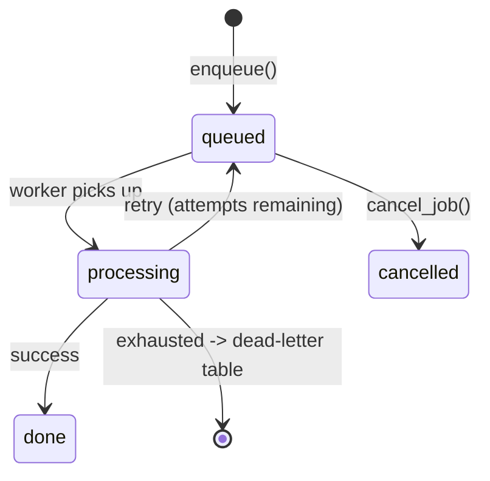

# Jobs

A job is an async Python function that Soniq runs in the background. You define it with a decorator, enqueue it with arguments, and a worker picks it up.

## Defining a job

```python
from soniq import Soniq

app = Soniq(database_url="postgresql://localhost/myapp")

@app.job
async def send_welcome_email(user_id: int, template: str = "default"):
    user = await get_user(user_id)
    await send_email(user.email, template)
```

The `@app.job` decorator registers the function. By default the task name is derived from `f"{module}.{qualname}"` (Celery-style), so the example above registers as `myapp.tasks.send_welcome_email`. The empty-parens form `@app.job()` works the same way (and is what you'll often see in code that started without kwargs and later grew them):

```python
@app.job()
async def cleanup_session(session_id: str):
    ...
```

Pass `name=` explicitly to override:

```python
@app.job(name="users.send_welcome_email")
async def send_welcome_email(user_id: int, template: str = "default"):
    ...
```

For cross-service deployments the explicit form is recommended — the name is the wire protocol, and module-derived names rot when functions are renamed.

## Decorator options

| Parameter | Type | Default | Description |
| --- | --- | --- | --- |
| `max_retries` | `int` | `3` | Times to retry after failure. Total attempts = max_retries + 1 |
| `queue` | `str` | `"default"` | Queue name for routing |
| `priority` | `int` | `100` | Lower number = higher priority |
| `retry_delay` | `int \| list[int]` | `0` | Seconds between retries, or per-attempt list |
| `retry_backoff` | `bool` | `False` | Apply exponential backoff to retry_delay |
| `retry_max_delay` | `int` | `None` | Cap on computed retry delay in seconds |
| `timeout` | `int` | `None` | Per-job timeout in seconds (falls back to global default of 300s) |
| `unique` | `bool` | `False` | Deduplicate: skip enqueue if an identical job is already queued |
| `validate` | `BaseModel` | `None` | Pydantic model to validate arguments at enqueue time |

```python
@app.job(
    max_retries=5,
    queue="billing",
    priority=10,
    retry_delay=[1, 5, 30],
    timeout=60,
    unique=True,
)
async def charge_subscription(account_id: str, amount: int):
    ...
```

## Enqueuing jobs

`enqueue` accepts three input shapes:

```python
# 1. Pass the function directly (most common, single-repo)
job_id = await app.enqueue(send_welcome_email, user_id=42)

# 2. Pass the task name as a string (cross-service / by-name)
job_id = await app.enqueue("users.send_welcome_email", args={"user_id": 42})

# 3. Pass a TaskRef (typed cross-repo stub - see the cross-service guide)
job_id = await app.enqueue(send_welcome_ref, args={"user_id": 42})
```

You can override decorator defaults at enqueue time:

```python
job_id = await app.enqueue(
    send_welcome_email,
    user_id=42,
    priority=1,          # override priority for this run
    queue="urgent",      # route to a different queue
    unique=True,         # deduplicate this specific enqueue
)
```

### Transactional enqueue

Enqueue a job inside the same database transaction as your application write. If the transaction rolls back, the job is never created.

```python
await app.ensure_initialized()
async with app.backend.acquire() as conn:
    async with conn.transaction():
        await conn.execute("INSERT INTO orders ...")
        await app.enqueue(send_welcome_email, connection=conn, user_id=42)
```

## JobContext injection

Declare a parameter typed as `JobContext` and Soniq injects runtime metadata automatically.

```python
from soniq import JobContext

@app.job
async def process_invoice(invoice_id: str, ctx: JobContext):
    print(f"Job {ctx.job_id}, attempt {ctx.attempt} of {ctx.max_attempts}")
    print(f"Running on worker {ctx.worker_id}, queue: {ctx.queue}")
```

`JobContext` fields:

| Field | Type | Description |
| --- | --- | --- |
| `job_id` | `str` | UUID of this job |
| `job_name` | `str` | Fully qualified function name |
| `attempt` | `int` | Current attempt number |
| `max_attempts` | `int` | Total allowed attempts |
| `queue` | `str` | Queue this job is running in |
| `worker_id` | `str \| None` | ID of the worker processing this job |
| `scheduled_at` | `datetime \| None` | When the job was scheduled to run |
| `created_at` | `datetime \| None` | When the job was enqueued |

## Argument validation with Pydantic

Pass a Pydantic model as `validate` to reject bad arguments before the job is enqueued:

```python
from pydantic import BaseModel

class EmailArgs(BaseModel):
    user_id: int
    template: str = "default"

@app.job(validate=EmailArgs)
async def send_welcome_email(user_id: int, template: str = "default"):
    ...

# This raises a validation error immediately, not when the worker runs
await app.enqueue(send_welcome_email, user_id="not_an_int")
```

## Job status lifecycle

`soniq_jobs` rows live in one of four states. Failures either re-queue the
row for another attempt, or move it into `soniq_dead_letter_jobs` once
retries are exhausted.



You can check a job's status at any time:

```python
job = await app.get_job(job_id)
print(job["status"])   # "queued", "processing", "done", "cancelled"

result = await app.get_result(job_id)  # return value of a completed job
```

### Managing jobs

```python
await app.cancel_job(job_id)    # cancel a queued job
await app.delete_job(job_id)    # remove a job entirely
await app.list_jobs(queue="billing", status="queued", limit=20)
```

To re-run a job whose retries have been exhausted, replay it from the
dead-letter table:

```python
new_job_id = await app.dead_letter.replay(job_id)
```
