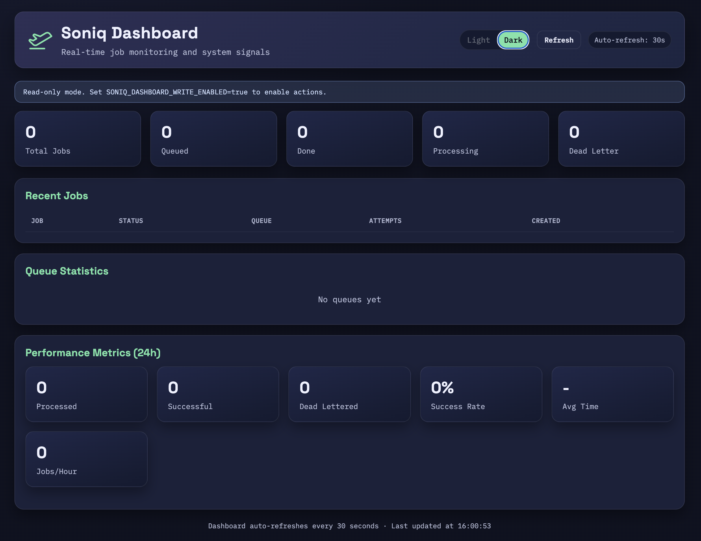

# Soniq

Background jobs for Python. Powered by the Postgres you already have.

## Quickstart

```bash
pip install soniq
```

```python
# jobs.py
from soniq import Soniq

app = Soniq(database_url="postgresql://localhost/myapp")

@app.job(max_retries=3)
async def send_welcome(to: str):
    print(f"Sending welcome email to {to}")
```

```python
# enqueue from anywhere in your app
await app.enqueue("jobs.send_welcome", args={"to": "dev@example.com"})
```

```bash
# set up tables and start processing
soniq setup
soniq start --concurrency 4
```

Four steps. Define a job, enqueue it, set up the database, start a worker.

!!! tip "Local dev without PostgreSQL?"
    Use SQLite: `Soniq(database_url="local.db")` (requires `pip install soniq[sqlite]`).
    For production, always use PostgreSQL.

[Full quickstart guide](getting-started/quickstart.md){ .md-button }

## Transactional enqueue

Enqueue a job inside your database transaction. If the transaction rolls back, the job never existed.

```python
async with pool.acquire() as conn:
    async with conn.transaction():
        await conn.execute("INSERT INTO orders ...")
        await app.enqueue("jobs.send_invoice", args={"order_id": order_id}, connection=conn)
        # Both commit together, or neither does
```

No Redis queue can do this. Your job and your data land in the same commit. If something fails halfway through, both roll back. No stale jobs, no ghost tasks, no cleanup scripts.

## Why Soniq

Most Python job queues force you to run Redis or RabbitMQ alongside your database. That's another service to deploy, monitor, back up, and debug when things go wrong at 3am.

Soniq uses your existing PostgreSQL. One dependency. One place your data lives. One thing to back up.

| Feature             | Soniq | Celery         | RQ     |
| ------------------- | --------- | -------------- | ------ |
| No Redis dependency | Yes       | No             | No     |
| Async native        | Yes       | Partial        | No     |
| Transactional enq.  | Yes       | No             | No     |
| Setup complexity    | Low       | High           | Medium |
| Built-in dashboard  | Yes       | No (Flower)    | No     |
| Dead-letter queue   | Yes       | No             | No     |

## Features

- **Retries with backoff** -- configurable delays, exponential backoff, per-attempt delay lists
- **Dead-letter queue** -- failed jobs preserved for inspection and manual retry
- **Job priorities** -- lower number = higher priority, processed first
- **Scheduled jobs** -- run at a specific time or after a delay
- **Recurring jobs** -- cron-based periodic tasks with `@app.periodic(cron="0 * * * *")`
- **Transactional enqueue** -- atomic with your database writes
- **Multiple queues** -- route jobs by type, run dedicated workers per queue
- **Middleware hooks** -- `before_job`, `after_job`, `on_error` for logging, metrics, tracing
- **Worker heartbeat** -- auto-detect crashed workers, requeue their jobs
- **Job results** -- store and retrieve return values from completed jobs
- **Deduplication** -- prevent duplicate jobs with `dedup_key` or `unique=True`
- **CLI** -- `setup`, `start`, `status`, `workers`, dead-letter management
- **Dashboard** -- web UI for monitoring queues, workers, and job state

## Dashboard

Monitor queues, workers, retries, and system health from a built-in web UI.

```bash
pip install soniq[dashboard]
soniq dashboard
```



## Install

```bash
pip install soniq              # core (PostgreSQL backend)
pip install soniq[full]        # everything below
pip install soniq[sqlite]      # SQLite backend for local dev
pip install soniq[scheduling]  # cron-based recurring jobs
pip install soniq[dashboard]   # web dashboard
pip install soniq[monitoring]  # Prometheus metrics
pip install soniq[webhooks]    # webhook delivery + signing
```

## When NOT to use Soniq

- **You need 10k+ jobs/sec sustained throughput.** PostgreSQL row locking has limits. Redis-backed queues like Celery or Arq are built for this.
- **You need cross-language consumers.** Soniq is Python-only. If your workers are in Go or Node, use RabbitMQ or a similar broker.
- **You're not using PostgreSQL.** The production backend requires PostgreSQL. If your stack is MySQL or MongoDB, this isn't for you.
- **You need DAG-based workflow orchestration.** Soniq handles individual jobs, not pipelines. Look at Prefect or Airflow.
